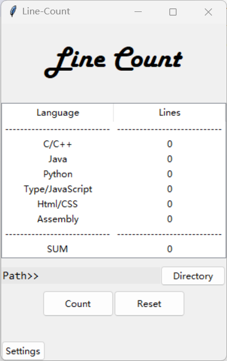
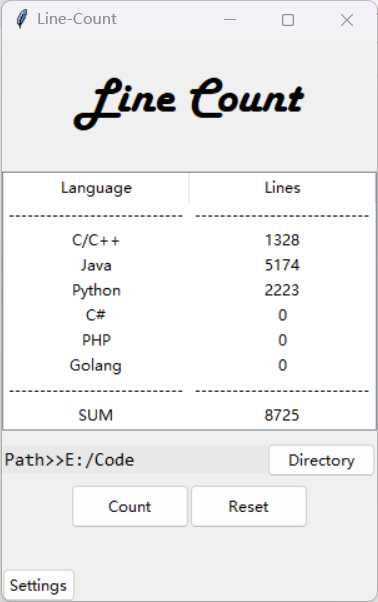
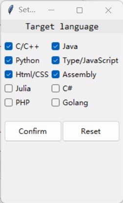

# Line-Count
简单的代码行数统计工具，可以统计指定目录下不同编程语言代码的行数，默认语言选项为 C/C++, Java, Python, Html/CSS, TypeScript/JavaScript, Assembly, 你可以在设置(Settings)中设置要统计的目标语言，目前除上述六种语言还支持 Julia, C#, PHP, Golang 四种语言，你也可以自行修改Setting.py中的源代码，加入其他你想统计的语言。目前支持一次性最多统计6种不同语言，你也可以通过修改Line-Count.py中关于Treeview的代码来增加一次性统计的语言数目。(修改时的注意事项之后会附在结尾)。

A simple tool to count the lines of code in your directory. The default language options is C/C++, Java, Python, Html/CSS, TypeScript/JavaScript and Assembly. You can change the target languages in the Settings, besides the six languages, the programe also support Julia, C#, PHP and Golang. If you want to add other languages, you can change the code in Setting.py. At present, the programe support to count at most six languages at one time,  you can also change this in Line-Count.py. (The details will be attached at the end later).

# 效果演示(Demonstration)

